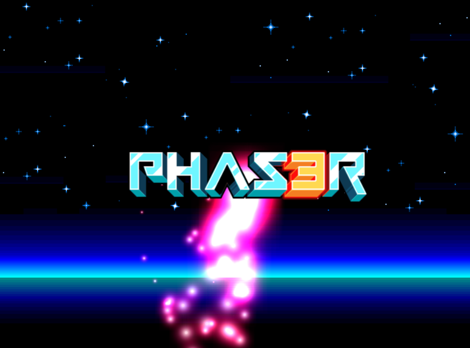

# Phaser 3 JavaScript Template

## What is Phaser?


Phaser is an HTML5 game framework which aims to help developers make powerful, cross-browser HTML5 games really quickly. It was created specifically to harness the benefits of modern browsers, both desktop and mobile. The only browser requirement is the support of the canvas tag.

- [Learn more](https://phaser.io)
- [Make your first game](https://phaser.io/tutorials/making-your-first-phaser-3-game/part1)


## Getting Started

1. Install Node.js 16.15.0 LTS from https://nodejs.org
1. Download or clone this project
1. Open the project directory from a terminal
1. Run `npm install`
1. Run `npm start`
1. Go to http://localhost:1234
1. You should see the Phaser 3 logo bouncing around your web browser.



## Terminal Commands

- `npm start` - builds the game and serves it from http://localhost:1234. Whenever a game file changes, the browser used to open the localhost url will automatically refresh.
- `npm run build` - builds the final game for distribution. The files will be located in the `dist` folder and can be hosted on a web server.

## Project Structure
```
└── src
    ├── assets          # images and sounds
    ├── scenes          # game scenes
    │   └── main.js     # your game code goes here
    ├── index.js        # configuration and starting point
    └── index.html      # web page that wraps the game
```

## Tools
- [Visual Studio Code](https://code.visualstudio.com/) - code editor
- [Tiled](https://www.mapeditor.org/) - fully featured level editor

## Learning Resources
- [Learn JavaScript](https://www.sololearn.com/learning/1024) - freemium
- [Make your first game](https://phaser.io/tutorials/making-your-first-phaser-3-game/part1)
- [Minimalist Games and Tutorials](https://www.lessmilk.com/)
- [Make 2D Games in JavaScript with Phaser](https://thomaspalef.gumroad.com/l/make-2d-games) - paid book
- [HTML5 Game Development Mini-Degree](https://academy.zenva.com/product/html5-game-phaser-mini-degree/) - paid videos
- [Phaser Learning Pages](https://phaser.io/learn)
- [Phaser Examples](https://phaser.io/examples/v3)
- [Phaser API Docs](https://newdocs.phaser.io/docs/3.55.2)